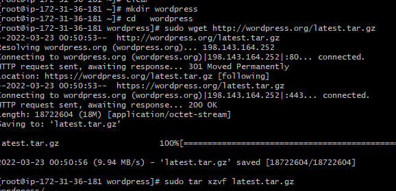
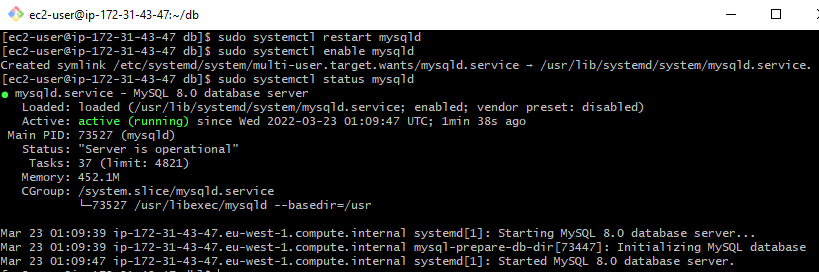
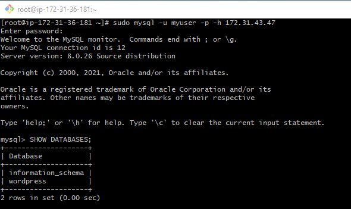
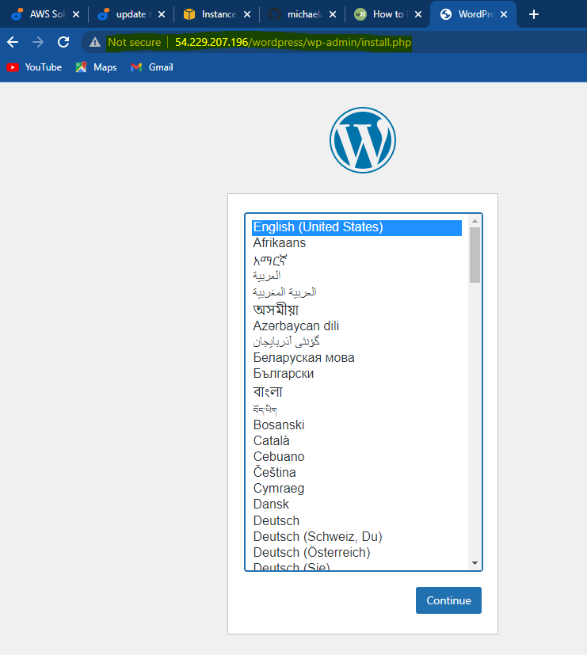
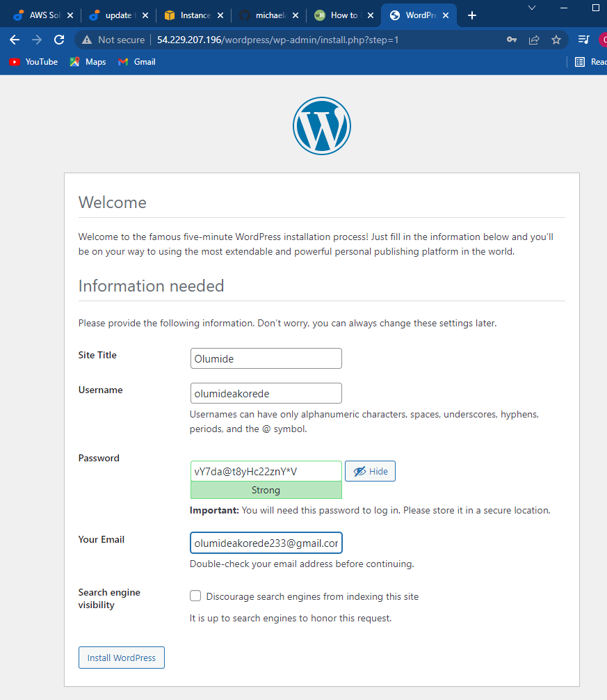

# WEB SOLUTION WITH WORDPRESS 

### In this project, I was asked to prepare storage infrastructure on two Linux servers and implement a basic web solution using WordPress.

    ## "WordPress is a free and open-source content management system written in PHP and paired with MySQL or MariaDB as its backend Relational Database Management System (RDBMS)".

### A. Three-teir Architcture

1. Presentation layer 
2. Business Layer
3. Data Access or management Layer 

    "Three-tier Architecture while also ensuring that the disks used to store files on the Linux servers are adequately partitioned and managed through programs such as gdisk and LVM respectively".
   

B. Your 3-Tier Setup

A Laptop or PC to serve as a client

An EC2 Linux Server as a web server

(This is where you will install WordPress)

An EC2 Linux server as a database (DB) server   

### Step 1: I Prepared a Web Server and created 3 volumes in the same AZ as Web Server EC2, each of 10GiB and I attached all the three volumes one by one to the web server EC2 instance I created. 

### Step 2: Next I used (lsblk) command to inspect what block devices are attached to the web server.

+ >use df -h to see all mounts and free space on the server

+ >use gdisk to create  a single partitiion on each of the 3disk
  
  
  

+ >use lsblk to view the newly configured partition on each of the 3 disks.

+ >I installed lvm2 package with sudo yum install lvm2
 

+ >Run sudo lvmdiskcan to check for availble partitions.

>Use pvcreate to mark each of 3 disks as physical volumes (PVs) to be used by LVM and verify the physical volume running successfully sudo pvs. 
  
  

Use vgcreate utility to add all 3 PVs to a volume group (VG). Name the VG webdata-vg

+ >sudo vgcreate webdata-vg /dev/xvdh1 /dev/xvdg1 /dev/xvdf1
+ >Verify that your VG has been created successfully by running sudo vgs
  
  
Use lvcreate utility to create 2 logical volumes

>sudo lvcreate -n apps-lv -L 14G webdata-vg

>sudo lvcreate -n logs-lv -L 14G webdata-vg

Verify that your Logical Volume has been created successfully by running sudo lvs

## Verify the entire setup

>sudo vgdisplay -v #view complete setup - VG, PV, and LV
sudo lsblk 

## Use mkfs.ext4 to format the logical volumes with ext4 filesystem

> sudo mkfs -t ext4 /dev/webdata-vg/apps-lv
> 
> sudo mkfs -t ext4 /dev/webdata-vg/logs-lv

## Create /var/www/html directory to store website files

> sudo mkdir -p /var/www/html

## I Mount /var/www/html on apps-lv logical volume using below command 

> sudo mount /dev/webdata-vg/apps-lv /var/www/html/

## I Used rsync utility to backup all the files in the log directory /var/log into /home/recovery/logs

> sudo rsync -av /var/log/. /home/recovery/logs/

I Mount /var/log on logs-lv logical volume. 

> sudo mount /dev/webdata-vg/logs-lv /var/log

I Restored log files back into /var/log directory

> sudo rsync -av /home/recovery/logs/. /var/log

## NOTE: I Updated /etc/fstab file so that the mount configuration will persist after restart of the server.

> sudo blkid

> I edited /etc/fstab file; with sudo vi /etc/fstab and Update /etc/fstab in this format using UUID and I removed the leading and ending quotes.

Next: I Test the configuration and reload the daemon

 >udo mount -a
 
 >sudo systemctl daemon-reload

>I verify the setup by running df -h,

NOTE: THE SECOND STAGE. 

## - I PREPARED THE DATABASE SERVER

I Launch a second RedHat EC2 instance that will have a role – ‘DB Server’
### But instead of apps-lv I created db-lv and mount it to /db directory instead of /var/www/html/.

### Step 1: I installed Wordpress on web server EC2

>I Updated the repository with sudo yum -y update

I Installed wget, Apache and it’s dependencies

> sudo yum -y install wget httpd php php-mysqlnd php-fpm php-json

Start Apache

> sudo systemctl enable httpd
& sudo systemctl start httpd

### The next phase, I installed PHP and it’s depemdencies.

> Next I Restarted Apache with sudo systemctl restart httpd

Download wordpress and copy wordpress to var/www/html

  >mkdir wordpress

  
  
  >cd   wordpress
  
  >sudo wget http://wordpress.org/latest.tar.gz
  
  >sudo tar xzvf latest.tar.gz
  
  >sudo rm -rf latest.tar.gz
  
  >cp wordpress/wp-config-sample.php wordpress/wp-config.php
  
  >cp -R wordpress /var/www/html/

I Configured SELinux Policies

  >sudo chown -R apache:apache /var/www/html/wordpress
  
  >sudo chcon -t httpd_sys_rw_content_t /var/www/html/wordpress -R
  
  >sudo setsebool -P httpd_can_network_connect=1

### Step 2 — Install MySQL on your DB Server EC2

> sudo yum update

> sudo yum install mysql-server

Verify that the service is up and running by using (sudo systemctl status mysqld)

The next stage is to:

## I configured DB to work with wordpress

>sudo mysql

>CREATE DATABASE wordpress;

>CREATE USER `myuser`@`172.31.36.181` IDENTIFIED BY 'Password000';

>GRANT ALL ON wordpress.* TO 'myuser'@'172.31.36.181';

>FLUSH PRIVILEGES;

>SHOW DATABASES;

>exit

### A. I configured wordpress to connect to remote database by open port 3306 on DB Server EC2

### B. I installed MySQL CLIENT from my web server to my DB server by using 
> sudo yum install mysql
 
>udo mysql -u admin -p -h 172.31.43.47

### C. I verify if you can successfully execute SHOW DATABASES

### D. I Changed the permissions and configuration so Apache could use WordPress:

### E. I Enabled TCP port 80 in Inbound Rules configuration for my Web Server EC2

### F. I access from my browser the link to my WordPress

(http://54.229.207.196/wordpress/)

